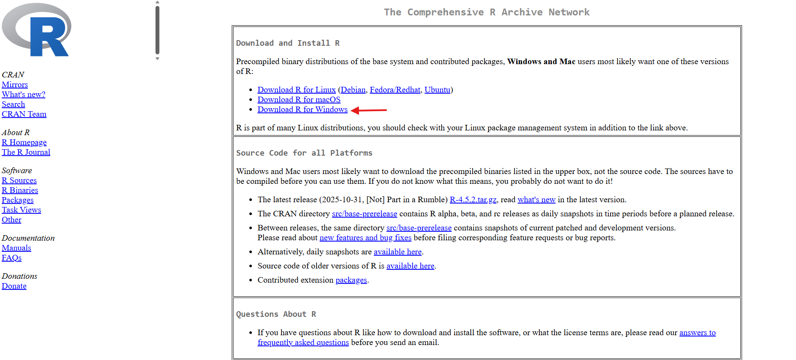
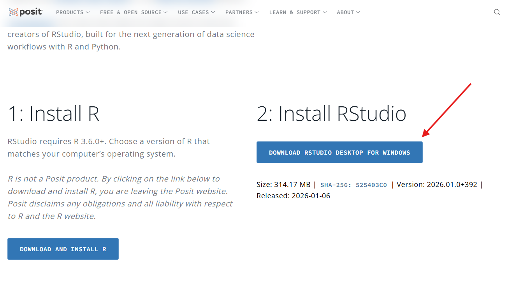
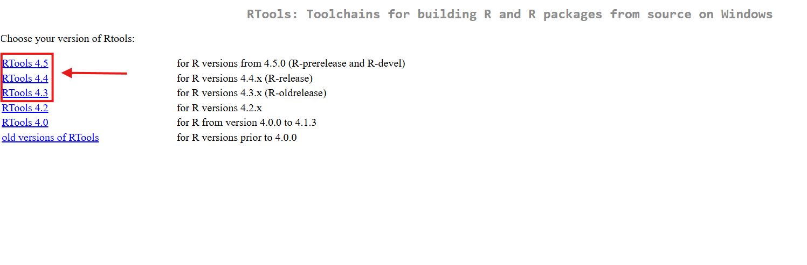
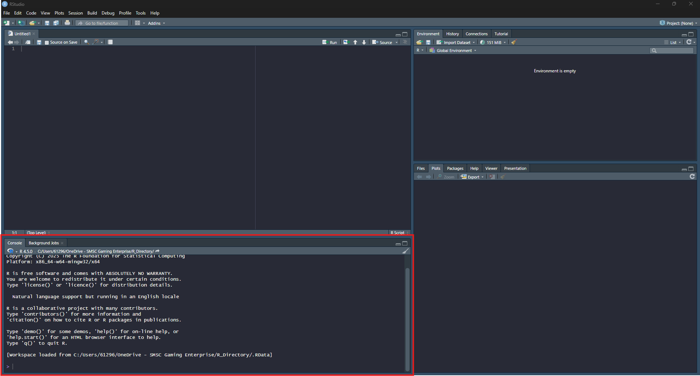
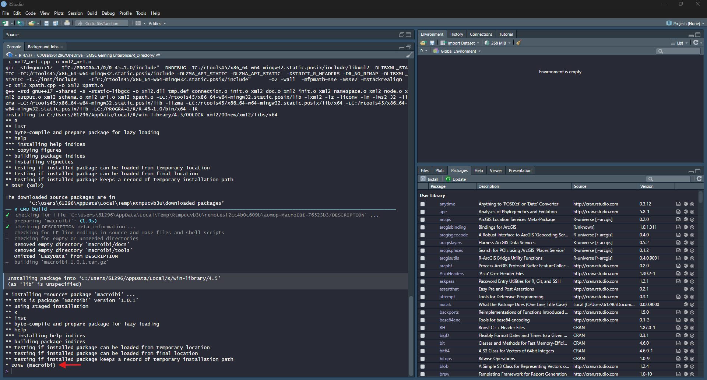
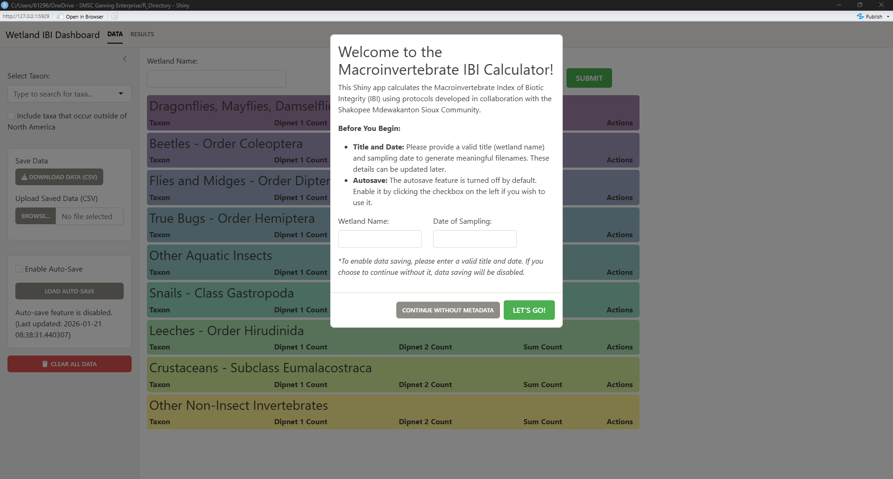

```{r, include = FALSE}
knitr::opts_chunk$set(
  collapse = TRUE,
  comment = "#>",
  eval = FALSE
)
```

## 1. Scope and Purpose

This document specifies the procedures for collecting, sorting, identifying, and scoring wetland macroinvertebrate samples using the MPCA protocol and the MacroIBI R/Shiny application. It covers the complete workflow from field collection through calculation of the Index of Biotic Integrity (IBI) and export of results.

The protocol is designed for family-level identification and does not require prior experience with R or programming. Section 7 provides installation instructions for personnel with no software background.

### 1.1 Definitions and Abbreviations

| Term | Definition |
|------|------------|
| **Effort** | One unit of collection consisting of 3–5 sweeps with a D-frame dip net. |
| **Sample** | The combined material from two efforts, processed as a single unit. |
| **EOT** | Ephemeroptera (mayflies), Odonata (dragonflies and damselflies), and Trichoptera (caddisflies). |
| **IBI** | Index of Biotic Integrity; the summed score of five component metrics (0–50). |
| **Richness** | The number of unique taxa recorded within a specified group. |

---

## 2. Equipment and Materials

### 2.1 Required Field Equipment

- Two D-frame dip nets (500 µm mesh)
- Hardware cloth and frame
- Plastic bin for catching material
- Sorting pans
- Sieve (200 µm)
- Squirt bottles (one water, one alcohol)
- Forceps (one per crew member)
- Wetland Invertebrate Visit Form
- GPS unit
- Pencils and clipboards
- Reagent alcohol (100%)
- Chest waders
- Plastic sample jars
- Permanent marker

### 2.2 Optional Field Equipment

- Site maps for navigation
- Scissors for preparing labels
- Camera for documenting site conditions
- Cooler or crate for sample transport

### 2.3 Required Laboratory Equipment

- Stereoscopes (2×–4× magnification)
- Petri dishes
- Taxonomic identification guides
- Squirt bottles (water or alcohol)
- Dissection tools
- Computer with R and the **macroibi** package installed

---

## 3. Sample Collection

### 3.1 Sampling Window

Collect samples between June and early July, when larvae are sufficiently developed for identification and wetlands still retain water. Sampling outside this window risks dry basins and unrepresentative or transient assemblages. When multiple sampling events are planned for a season, conduct all events within this window.

### 3.2 Habitat Selection

Sample the highest-priority habitat zone present at the site, following this order:

1. Emergent vegetation (typically the richest fauna)
2. Floating-leaf vegetation
3. Submerged vegetation
4. Shallow open water

Record the zone or zones sampled on the visit form.

### 3.3 Collection Procedure

1. **Establish the sampling area.** Select the highest-priority habitat available and work within a 10–15 m radius.

2. **Collect two efforts per sample.** For each effort, perform 3–5 strong sweeps through vegetation and the water column. Do not scrape sediment. If sediment is collected, discard the material and restart the effort.

3. **Sort for 10 minutes.** Transfer both efforts onto the hardware cloth positioned above the bin, start a 10-minute timer, and sort as described in Section 4.

4. **Collect the second sample.** Remain within the same habitat zone and select new micro-locations. Samples may be processed in combination or kept separate; in either case both contribute to a single IBI evaluation.

> **Note:** With larger crews, one group may begin the second sample while another completes sorting of the first. This substantially reduces total time on site.

---

## 4. Field Sorting and Preservation

### 4.1 Sorting Period (10 minutes)

1. Rinse vegetation so that organisms are dislodged into the pans.
2. Transfer organisms into water-filled pans using forceps.
3. At the end of 10 minutes, return the rinsed vegetation to the wetland. All organisms remaining in the bin constitute the sample.

### 4.2 Preservation

1. Pour the pans through the 200 µm sieve, flushing snails and leeches into the sieve.
2. Back-flush the sieve into sample jars using alcohol only.
   - Target a final concentration of approximately 80%.
   - Split the sample across additional jars if any jar exceeds one-third full.
3. Label each jar with site ID, date, sample number, jar number, and crew initials.
4. Store jars in the hazardous-materials room and inspect periodically for evaporation.

> **Caution:** Do not back-flush with water. Dilution below approximately 80% alcohol compromises preservation.

---

## 5. Laboratory Identification and Enumeration

1. **Confirm software availability.** Verify that R and the MacroIBI application are installed and functional (Section 7).

2. **Prepare the workspace.** Set out stereoscopes, petri dishes, dissection tools, identification guides, and the sample to be processed.

3. **Identify and enumerate all individuals.**
   - Every individual in the sample must be identified and counted.
   - Family-level identification is required; genus is preferred and species is recorded where feasible.
   - Assign one person to data entry; remaining personnel relay taxa and counts.
   - Pre-sorting specimens into visually similar groups improves throughput.
   - Samples may be rinsed with water to reduce irritation during processing.

> **Caution:** If the sample must remain preserved after identification, do not introduce water at any stage.

4. **Enter data at regular intervals.** Relay taxa and counts to the data handler for entry into the application.
   - When efforts have been combined, enter all counts under "Dipnet 1."
   - See Section 8 for the full application workflow.

---

## 6. Metric Definitions and Scoring

The application calculates six reported metrics and one composite score. Definitions are provided here for offline reference; the same formulas are available in the application under "How are these calculated?"

- **Total Individuals** — Sum of all individuals entered across both dipnets and all taxonomic groups.
- **EOT richness** — Number of unique taxa within the EOT orders.
- **Snail richness** — Number of unique taxa within Gastropoda.
- **All-taxa richness** — Number of unique taxa across all groups entered.
- **Corixid ratio** — \(\text{Corixidae individuals} / (\text{all true bugs} + \text{beetles})\). Elevated ratios indicate potential nutrient loading; the metric score decreases as the ratio increases.
- **Abundance of EOT** — \(\text{Total EOT individuals} / \text{Total individuals}\).
- **IBI Score (0–50)** — Sum of five component scores, each ranging from 0 to 10.

Component scores are scaled between anchor values derived from reference data:

- *Metrics that decrease with disturbance:* EOT richness (1–12 taxa), snail richness (1–10 taxa), all-taxa richness (10–40 taxa), and abundance of EOT (0–0.16). Values below the lower anchor score 0; values at or above the upper anchor score 10.
- *Metrics that increase with disturbance:* the Corixid ratio is anchored at 0 (best condition) and 1.0 (worst condition), with a 5th–95th percentile band of 0–0.82 defining the scale. Values above the upper anchor score 0.

The reported IBI score is the sum of the five capped component scores, with a maximum of 50.

---

## 7. Software Installation

This section describes installation of the two programs required to run MacroIBI. No prior experience with R or programming is required. Complete the steps in order.

| Program | Function |
|---------|----------|
| **R** | The computing engine underlying the application. No direct interaction is required. |
| **RStudio** | The interface used to run commands and launch the application. |

### Step 1: Install R

1. Navigate to **<https://cran.r-project.org>**.
2. Select the download link for the relevant operating system:
   - **Windows:** "Download R for Windows" → "base" → "Download R-4.x.x for Windows"
   - **Mac:** "Download R for macOS" → select the build matching the processor (Apple Silicon or Intel)
3. Open the downloaded file and run the installer.
4. Accept all default options.



---

### Step 2: Install RStudio

1. Navigate to **<https://posit.co/download/rstudio-desktop/>**.
2. Scroll to "All Installers" and select the download for the relevant operating system.
3. Open the downloaded file and run the installer.
4. Accept all default options.



---

### Step 3: Install Rtools (Windows only)

Rtools enables R to install packages that require compilation. This step is required on Windows and is not applicable on macOS.

1. Navigate to **<https://cran.r-project.org/bin/windows/Rtools/>**.
2. Download "Rtools45", or the version corresponding to the installed R version.
3. Run the installer.
4. Accept all default options.



---

### Step 4: Open RStudio

- **Windows:** Open the Start menu, search for "RStudio", and select it.
- **Mac:** Open Finder → Applications → RStudio.

The RStudio window is divided into panels. Commands are entered in the **Console**, identified by the `>` prompt and located in the lower-left area by default.



---

### Step 5: Install the MacroIBI Package

Enter the following commands in the Console:

1. Click in the Console, adjacent to the `>` prompt.
2. Type or paste the command.
3. Press Enter to execute.
4. Wait for the `>` prompt to reappear before entering the next command.

Install the "remotes" helper package:

```r
install.packages("remotes")
```

Install MacroIBI:

```r
remotes::install_github("aomop/MacroIBI")
```

Installation retrieves the package over the internet and typically requires 1–2 minutes.



> **Note:** Red output referencing "Rtools" indicates that Step 3 has not been completed. Install Rtools and repeat this command.

---

### Step 6: Launch the Application

Enter the following commands, pressing Enter after each:

```r
library(macroibi)
run_macroibi()
```



---

### Step 7: Verify the Installation (optional)

Launch the application in demonstration mode:

```r
library(macroibi)
run_macroibi(demo_mode = TRUE)
```

Acknowledge the demonstration message, then select **Load Autosave** in the left sidebar. The presence of demonstration files confirms a working installation.

---

### Closing the Application

Terminate the session by any of the following:

- Closing the browser tab
- Selecting the red **Stop** icon in the RStudio Console
- Pressing Escape with the cursor active in the Console

---

## 8. Application Workflow

Start the dashboard:

```r
library(macroibi)
run_macroibi()
```

Enter the sample title and date, then select **Let's go!** The application may also be started without metadata when data will be uploaded or an autosave reloaded.

### Step 1: Enable Autosave

Before entering data, locate **Autosave Settings** in the left panel of the Data tab and select **Enable Auto-Save**.

Autosave performs the following functions:

- Saves progress at regular intervals
- Stores autosaves separately for each user
- Permits recovery following an unexpected shutdown
- Maintains the session history used for reports and comparisons

Previous sessions are restored using **Load Autosave**.

> **Note:** The Data Summary and Full Report outputs require available autosave history.

---

### Step 2: Enter Taxa and Counts

On the Data tab, use **Select Taxon** to search for and add taxa. The application assigns each taxon to the appropriate group automatically.

Each row reports:

- Taxon name
- Dipnet 1 count
- Dipnet 2 count
- Sum count (calculated)

Each group footer updates continuously and reports:

- Total taxa
- Percent of total sample
- Total individuals

---

### Step 3: Review Metrics

Open the **Results** tab to view IBI calculations, which update in real time. Reported values are:

- Total Individuals
- EOT richness
- Snail richness
- All-taxa richness
- Corixid ratio
- Abundance of EOT
- **Overall IBI score (0–50)**

Metric definitions and scoring anchors are given in Section 6.

---

### Step 4: Export Outputs

The following outputs are available for download:

1. **Raw Data CSV** — For archiving or re-uploading into the application. Use only CSV files exported from MacroIBI and not subsequently edited; externally prepared or modified files may produce invalid metric calculations.
2. **Results CSV** — Final calculated scores in tabular form.
3. **Table Image (PNG)** — Formatted metric table including title and date.
4. **Data Summary (PDF)** — One-page summary of current metrics.
5. **Full Report (PDF)** — Comprehensive report including current metrics and comparisons against other autosaved sessions.

> **Note:** PDF reports require autosave history to generate comparisons.

---

## 9. Additional Features

### 9.1 Taxonomic Hierarchy Viewer

Select **Show/Hide Taxonomic Hierarchy** to display a taxonomic tree of the selected taxa. This is used to verify correct group assignment.

### 9.2 Restoring Previous Sessions

Upload any previously exported **Raw Data CSV** to restore the data tables as saved.

### 9.3 Clearing Data

**Clear All Data** resets the session in full.

> **Caution:** This action cannot be reversed if the data has not been saved or exported.

---

## 10. Troubleshooting

**"Error: package 'remotes' is not available"**
Run `install.packages("remotes")`, then repeat the failed command.

**Red output referencing "Rtools" or "compilation" (Windows)**
Install Rtools (Section 7, Step 3), restart RStudio, and repeat the command.

**"Cannot open URL" or other network errors**
Verify the internet connection. On managed or institutional networks, retry from an unrestricted connection or consult IT regarding firewall restrictions.

**PDF or image export fails**
PDF export requires additional supporting software. In the Console, run:

```r
webshot2::install_phantomjs()
```

**Application will not start, or "could not find function"**
Confirm that `library(macroibi)` has been run. This command is required in each new RStudio session.

**"Object not found" errors during use**
Close and relaunch the application. If the error persists, clear the data and re-enter it.

**Unresolved issues**
Contact Sam Swanson at sam.swanson@shakopeedakota.org.
